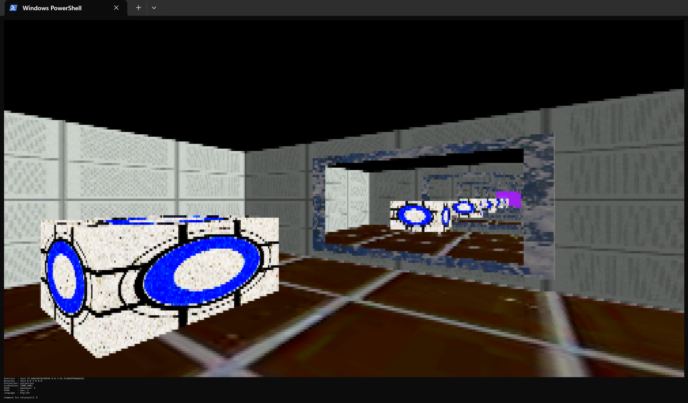
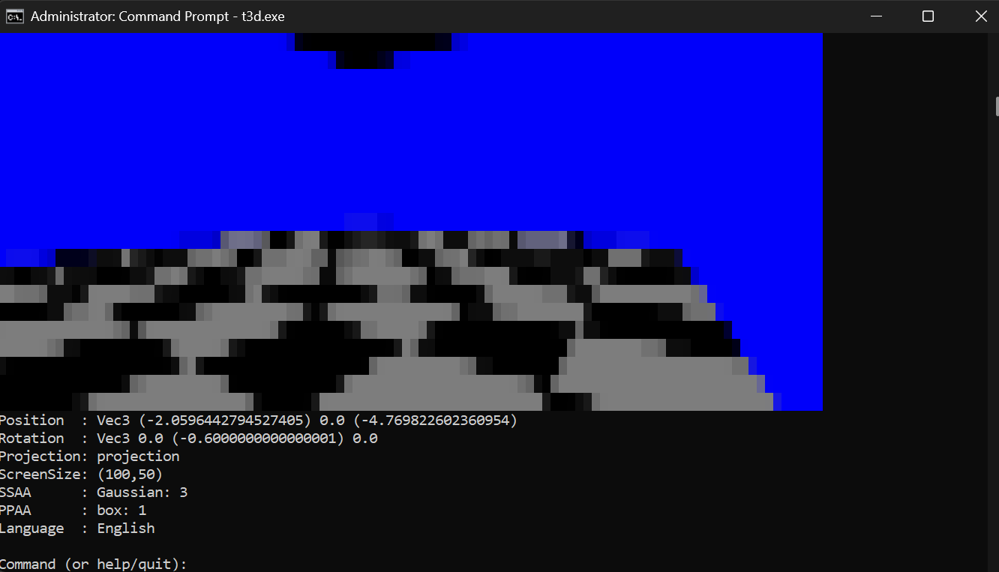
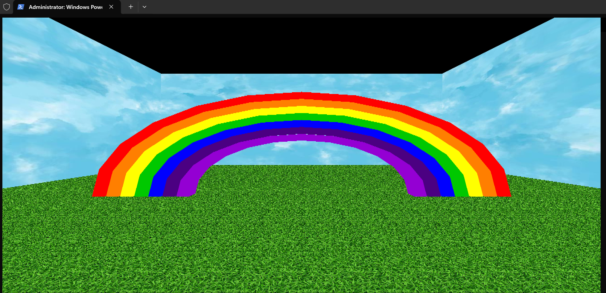

# Terminal3DGraphics

# Terminal3DGraphics

This is a little 3D engine written in Haskell that draws straight into your terminal. You can walk around the scene with keyboard input, and it all renders in true-colour using ANSI half-block characters (▀), which lets each character cell show two stacked "pixels". This works on both Linux and Windows and also exports as a library if anyone wants to make custom 3D worlds.

# Features

 - Movement around the worlds is done via entering keys on the keyboard and pressing enter. 
 - Allows for Portals with recursive views through
 - Allows for selections of post processing and super sampling anti-aliasing
 - Has multiple demo worlds
 - Translations are selectable in the program
 - Allows customizable screen size
 - Pipelines auto-build versions for X64 Linux and Windows
